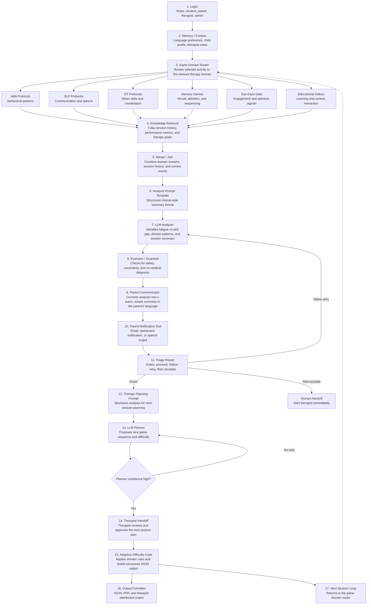

# NeuroPlay AI Agent Workflow

This document explains how the proposed AI agent workflow connects to NeuroPlay's existing therapeutic gaming platform. The current project already captures game performance, face-expression signals, pose data, hand-tracking activity, eye-gaze metrics, and user progress through a React frontend and Express/MongoDB backend. The workflow below describes how those signals can be organized into an AI-assisted therapy support layer.

## Workflow Diagram

## How This Relates To NeuroPlay

NeuroPlay is the data-producing platform: children complete therapeutic games and activities while the system records scores, reaction time, accuracy, expression data, movement quality, gaze behavior, and progress over time.

The AI agent workflow is the interpretation layer: it takes those raw signals, routes them into therapy domains, summarizes patterns, communicates results to parents, and prepares therapist-reviewed next-session plans.

## Implemented Foundation

- 6 therapeutic games covering emotion recognition, reaction patterns, facial expression practice, pose imitation, sound localization, and hand-tracking coordination.
- 4 role-based dashboards for student, parent, therapist, and admin workflows.
- Real-time browser-based AI/ML using face-api.js, TensorFlow.js, MediaPipe, and WebGazer.
- MongoDB-backed storage for users, game sessions, progress, face capture, gaze tracking, and videos.
- JWT authentication, protected routes, multilingual support, and clinical analytics views.

## Proposed AI Agent Layer

- Domain router that maps each game or activity to behavior, communication, motor, memory, gaze, or educational categories.
- Retrieval step that combines current results with recent session history and therapy goals.
- LLM analyzer that summarizes performance patterns such as fatigue, skill gaps, and progress trends.
- Safety guardrail that blocks medical diagnosis language and escalates uncertain or high-risk outputs.
- Parent communicator that converts technical results into a clear summary in the parent's preferred language.
- Triage router that labels sessions as green, yellow, or red based on confidence and risk.
- Planner that proposes next-session game sequence and difficulty, requiring therapist approval before use.

## Safety Design

The workflow is designed as a support tool, not an autonomous diagnostic system. AI-generated outputs should avoid medical diagnosis, include uncertainty where appropriate, and require therapist review for therapy planning. Red triage cases are routed directly to human handoff.

## Recruiter Summary

NeuroPlay combines full-stack product engineering with applied AI and responsible workflow design: a therapeutic gaming platform that can evolve from raw interaction tracking into AI-assisted, therapist-supervised progress analysis and adaptive session planning.
